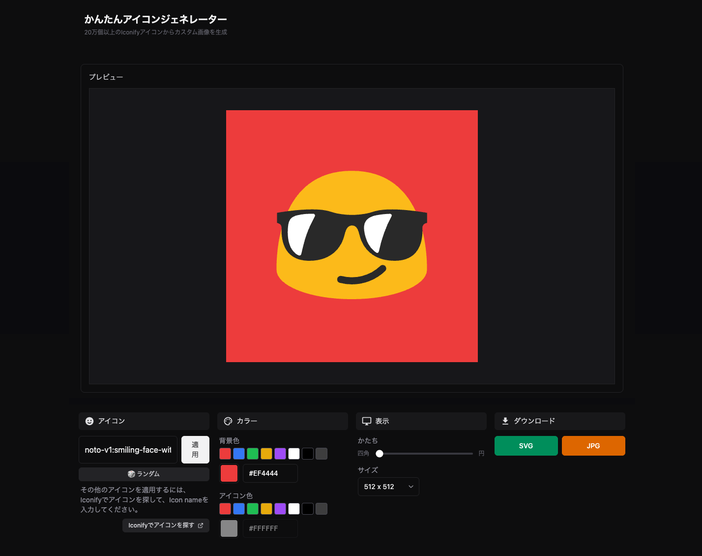

# かんたんアイコンジェネレーター

Iconifyアイコンを使用して、カスタム画像を作成できるツールです。
全てのIconifyアイコンを使用できます。

## 使い方

1. [Iconify](https://iconify.design/)でアイコンを探して、アイコン名を入力してください。  
見つけるのが面倒な人はランダムボタンをクリック🎲
2. 背景色とアイコンの色を設定します（色付きの絵文字を使用する場合アイコンの色は設定できません）
3. かたちとサイズを選んでダウンロード
