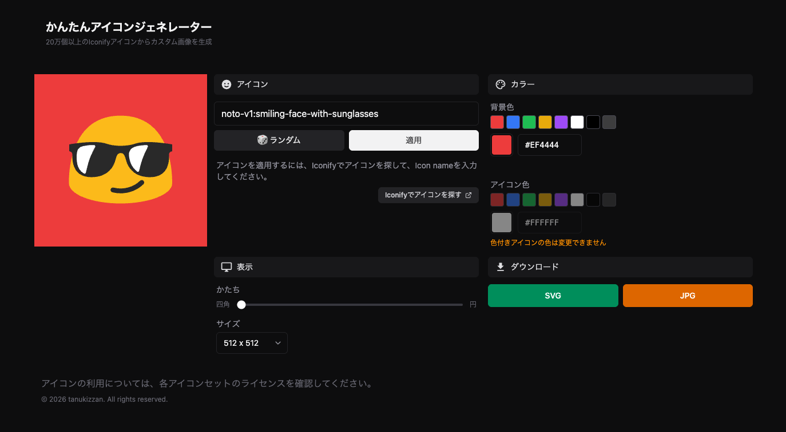

# かんたんアイコンジェネレーター

Iconifyアイコンを使用して、カスタム画像を作成できるツールです。
全てのIconifyアイコンを使用できます。

## 使い方

1. [Iconify](https://iconify.design/)でアイコンを探して、アイコン名を入力してください。  
見つけるのが面倒な人はランダムボタンをクリック🎲
2. 背景色とアイコンの色を設定します
3. かたちとサイズを選んでダウンロード

## 注意事項

- 色付きアイコンを使用する場合は、アイコンの色は設定できません。
- アイコンの利用については、各アイコンセットのライセンスを確認してください。
